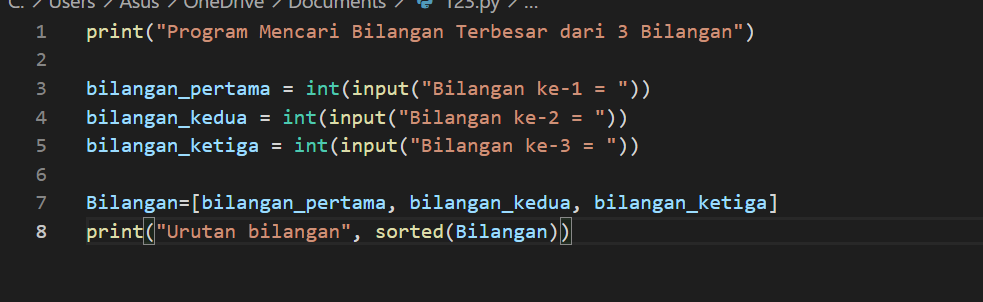
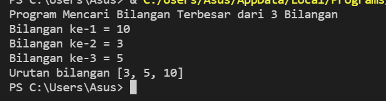
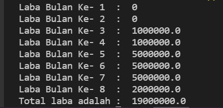

# Praktikum3

## Latihan 1, Menentukan Bilangan Terbesar dari Dua Buah Bilangan

Scriptnya seperti ini

Lalu masukkan dua bilangan yang diinginkan, misalnya bilangan pertama adalah 1 dan bilangan kedua adalah 2.

Jika bilangan pertama lebih besar dari bilangan kedua, maka hasilnya "Bilangan Pertama Lebih Besar", Namun Jika bilangan kedua lebih besar dari bilangan pertama, maka hasilnya "Bilangan Kedua Lebih Besar"
Karena 2 lebih besar dari 1, berarti bilangan kedua     lebih besar dari bilangan pertama. Maka hasilnya "Bilangan Kedua Lebih Besar"

## Latihan 2 , Mengurutkan Data Mulai dari yang Terkecil

## Latihan 1.2 , Program Pengulangan Bertingkat

Scriptnya seperti ini

Maka outputnya akan muncul seperti ini

Angka yang muncul akan sesuai dengan range yang diberikan, misalnya range (1,11) maka akan muncul [1,2,3,4,5,6,7,8,9,10], dan seterusnya.

## Latihan 2.1 , Menampilkan Bilangan Acak Kurang Dari 0.5

Script nya seperti ini 

Misalnya kita masukkan jumlah N nya adalah 5
Dan outputnya akan seperti ini

Akan memunculkan angka random kurang dari 0.5 sebanyak 5 data

## labspy02 , Menentukan Bilangan Terbesar dari 3 Bilangan

### Program 

Scriptnya seperti ini :

Misalnya kita masukkan bilangan pertama adalah 1, bilangan kedua adalah 2 dan bilangan ketiga adalah 3
Maka outputnya akan muncul seperti ini

Karena bilangan ketiga lebih besar dari bilangan pertama dan bilangan kedua, maka hasilnya "Bilangan yang terbesar adalah bilangan ketiga"

### Flowchart

## labpy03.1 , Menampilkan bilangan acak kurang dari 0.5

Scriptnya seperti ini :

Misalnya kita masukkan jumlah N adalah 5
Maka outputnya akan seperti ini :

Akan memunculkan angka random kurang dari 0.5 sebanyak 5 data

## labpy03.2 Menentukan Bilangan Terbesar dari N buah data

## labpy03 Menentukan Total Laba

-SEKIAN-